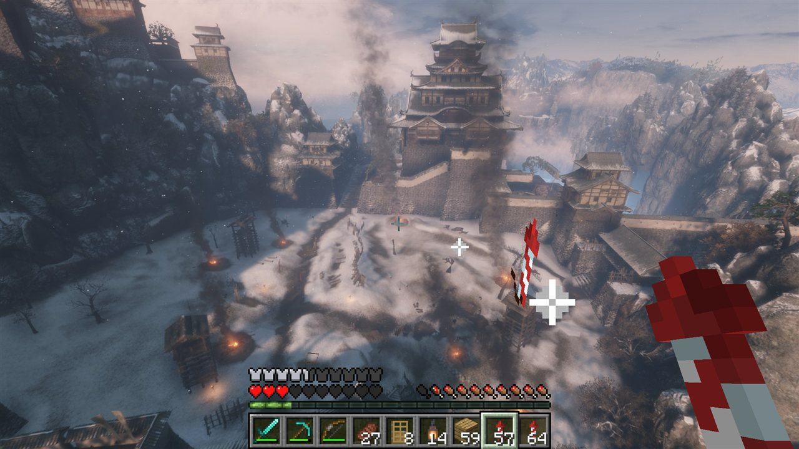
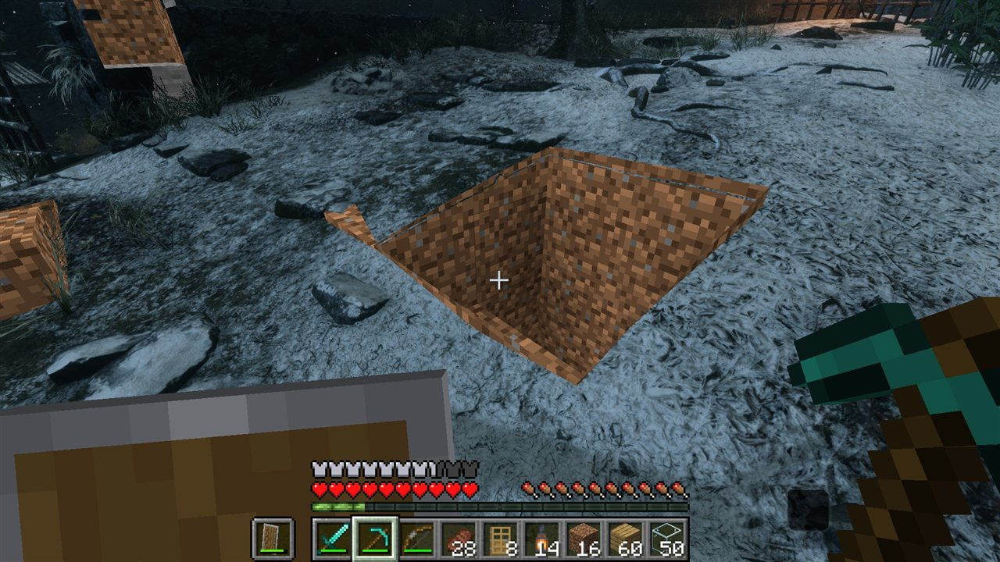
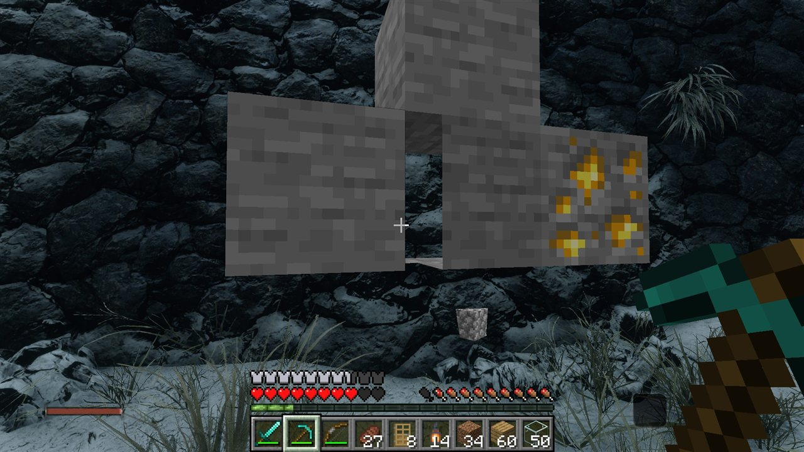
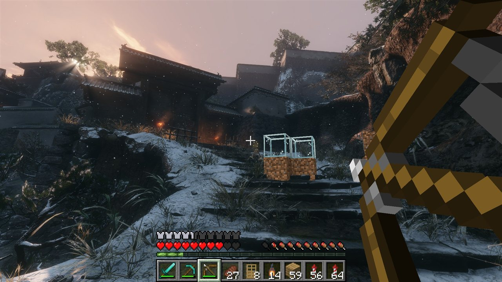
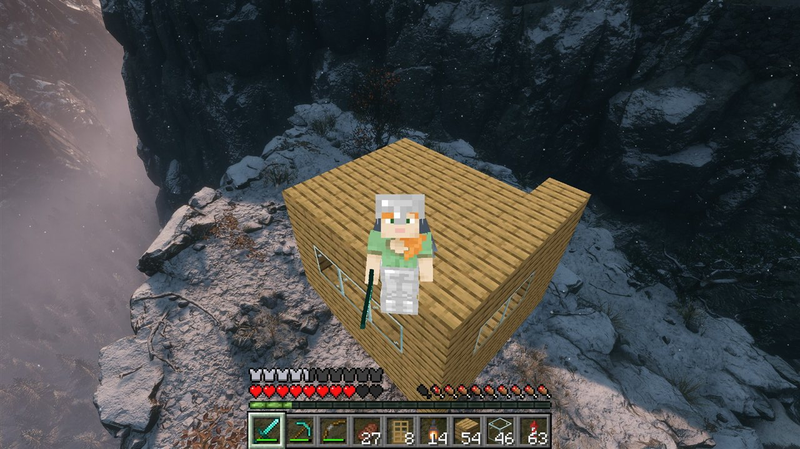
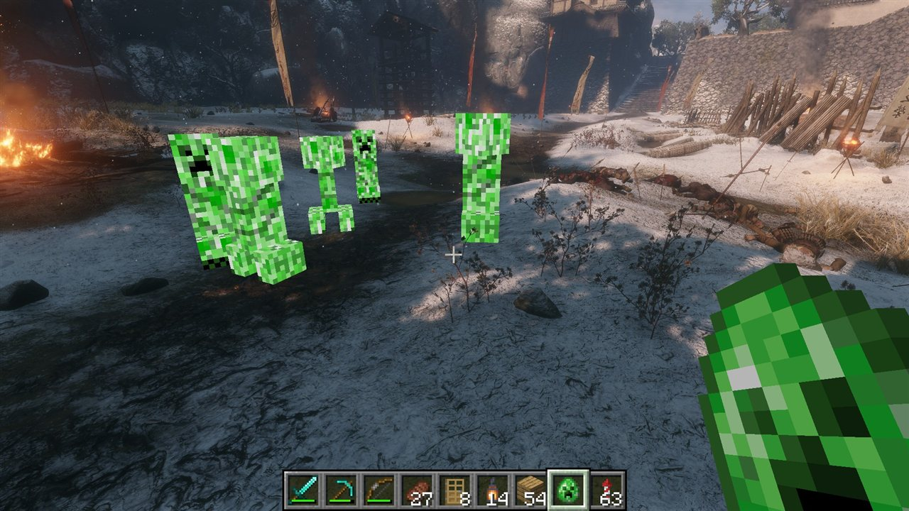
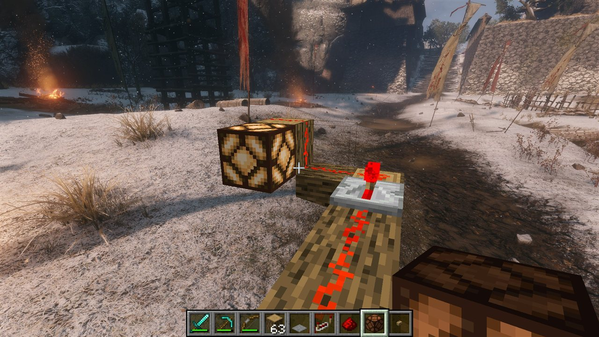

# SekiCraft

Play Sekiro: Shadows Die Twice as a Minecraft player. You walk around Ashina with Minecraft's movement and physics, see Minecraft's hotbar, hearts, hand and inventory, and collide with Sekiro's real walls and ground.



| Digging into Sekiro's ground | Mining a castle wall | Blocks on Sekiro's stairs |
|---|---|---|
|  |  |  |
| **A house on a cliff (F5 third person)** | **Creepers in Ashina** | **Redstone works** |
|  |  |  |

Neither game is rewritten. Both run at the same time:
- **Sekiro** runs its world, enemies and saves.
- **Minecraft** runs the player.

Two mods connect them through shared memory: a DLL inside Sekiro and a Fabric mod inside Minecraft. SekiCraft builds on [SkyCraft](https://github.com/chasmlol/SkyCraft) (Minecraft inside Skyrim), whose Minecraft-side mod it forks.

> **Status: early and experimental.** Expect rough edges, and back up your Sekiro saves.
> This is a fan project, not affiliated with FromSoftware, Activision, Mojang or Microsoft. You need to own both games; no game files are included here.

## What works

| | |
|---|---|
| Minecraft controls | **F10** switches to Minecraft: first-person camera at the Minecraft player's eye, mouse look, WASD, jump, sprint. Wolf is hidden and follows you, so Sekiro's enemies still see you. **F9** or **Esc** switches back |
| Collision | Minecraft's physics collides with Sekiro's real ground, slopes, stairs and walls. They're measured live with the game's own ray casts around the player |
| HUD | Minecraft's hotbar, hearts, hunger, crosshair, hand and inventory drawn over Sekiro. Clicking, scrolling and moving items work |
| Blocks | Place and break blocks on Sekiro's ground. They're drawn in Sekiro's 3D view with Minecraft's textures and hidden behind Sekiro's walls, rocks and trees. Not yet lit by Sekiro's light |
| Entities | Dropped items, arrows, block cracks, the targeted block's outline, Minecraft mobs and particles, and your own body in third person (F5) |
| Digging | Dig into Sekiro's ground: grass, dirt, then stone with ores. Holes are cut out of Sekiro's picture and you can climb down into them. Cliffs and walls dig approximately |
| Combat | Hit Sekiro's enemies with Minecraft weapons and arrows (HP and posture). A hit on a broken posture is a deathblow, and bosses lose one life (red dot) per deathblow. Enemies' hits cost Minecraft hearts, in proportion to Wolf's health, and a shield blocks them |
| Death | Dying in Minecraft kills Wolf too (Sekiro's own death and respawn); Sekiro's HUD is hidden while Minecraft has control |
| Creative | **F4** switches between Survival and Creative: fly, instant breaking, the full item list with search |
| One click | `Play SekiCraft.bat` starts Sekiro, which starts Minecraft; Minecraft saves and quits when Sekiro closes |

**Planned:**
- Sekiro's lighting on blocks

See [docs/DESIGN.md](docs/DESIGN.md) for how it works, the memory addresses used, and the roadmap.

## Requirements

**To play**

| | |
|---|---|
| Windows | 10 or 11, 64-bit |
| Sekiro: Shadows Die Twice | Steam, version **1.06** (the current Steam version) |
| Minecraft: Java Edition | You should own it. The current build starts Minecraft through Gradle, without signing in to your account |
| Memory | 16 GB RAM recommended: Sekiro and Minecraft run at the same time |

**To build** (needed until there's a ready-made download)

| Tool | Get it from |
|---|---|
| Git | [git-scm.com](https://git-scm.com/download/win) |
| Visual Studio 2022 Build Tools, workload *Desktop development with C++* | [visualstudio.microsoft.com](https://visualstudio.microsoft.com/visual-cpp-build-tools/) |
| CMake | [cmake.org](https://cmake.org/download/), or the workload's *C++ CMake tools for Windows* component |
| Java 25 JDK (Eclipse Temurin) | [adoptium.net](https://adoptium.net/temurin/releases/?version=25). Install it to the default folder so SekiCraft finds it |
| me3 v0.13.0 | [me3 releases](https://github.com/garyttierney/me3/releases): it loads the DLL into Sekiro and neutralizes Sekiro's anti-tamper code |

## Installation

There's no ready-made download yet, so you build SekiCraft yourself. It takes about 15 minutes, most of it downloads.

1. **Back up your Sekiro saves.** Copy the folder `%APPDATA%\Sekiro` somewhere safe.
2. **Install the tools** from the table above.
3. **Get the code.** In a command prompt:

   ```bat
   git clone https://github.com/NIHKOOL/SekiCraft.git
   cd SekiCraft
   ```

4. **Build the Sekiro side.** Open *x64 Native Tools Command Prompt for VS 2022* from the Start menu, go to the `SekiCraft` folder, and run:

   ```bat
   cmake -S sekiro -B sekiro\build -G "NMake Makefiles" -DCMAKE_BUILD_TYPE=Release
   cmake --build sekiro\build
   ```

   This makes two DLLs in `sekiro\build`:
   - `sekicraft.dll`, a small loader
   - `sekicraft_core.dll`, the logic. The loader hot-reloads it whenever it's rebuilt, so you can change code without restarting Sekiro.

5. **Build the Minecraft side.** In the `SekiCraft` folder:

   ```bat
   cd fabric
   gradlew build
   ```

   The first build downloads Minecraft, Fabric and Gradle (a few minutes). If it says Java is missing or too old, point `JAVA_HOME` at the Java 25 JDK first, for example `set "JAVA_HOME=C:\Program Files\Eclipse Adoptium\jdk-25.0.4.101-hotspot"`.

6. **Add me3.** Download `me3-windows-amd64.zip` from the [me3 releases](https://github.com/garyttierney/me3/releases) and unzip it into `tools\me3`, so that `tools\me3\bin\me3.exe` exists.

SekiCraft doesn't change any files in Sekiro's or Minecraft's install folders. To uninstall, delete the `SekiCraft` folder.

## Playing

1. Double-click **`Play SekiCraft.bat`**. It starts Sekiro offline through me3, and Sekiro starts Minecraft in the background. The first time takes a few minutes; later about a minute. Minecraft's window hides itself once it's linked.
2. Load a save. When you can control Wolf, press **F10**.
3. Quit Sekiro as usual. Minecraft saves and closes by itself a few seconds later.

Sekiro always runs offline while SekiCraft is loaded.

What Sekiro starts for Minecraft is set in `sekiro\build\sekicraft.ini`, written on the first run (from a source checkout: `gradlew runClient` in `fabric`). Leave `minecraft_command` empty to start Minecraft yourself.

## Troubleshooting

| Problem | Try |
|---|---|
| F10 does nothing | Minecraft isn't ready yet. Wait a minute after Sekiro's title screen, then try again |
| Minecraft never starts | Check that Java 25 is installed (step 5). Minecraft's log is `fabric\run\logs\latest.log` |
| You fall through the ground right after loading | Wait a few seconds after the load before pressing F10. If you fall more than 30 m, you're put back where you pressed F10 |
| Minecraft keeps running after Sekiro closed | It closes 5 seconds after Sekiro. If it doesn't, end `java.exe` in Task Manager |
| Anything else | Sekiro's side logs to `sekiro\build\sekicraft.log`. Open an issue with that file and `fabric\run\logs\latest.log` |

## Controls

| Key | |
|---|---|
| **F10** | Minecraft controls |
| **F9** / **Esc** | Back to Sekiro controls. Esc closes an open Minecraft screen first |
| **F4** | Survival / Creative |
| Minecraft keys | WASD, Space, Shift, Ctrl, E (inventory), T (chat), 1–9 and mouse wheel (hotbar), mouse buttons. Typing works in Minecraft's text boxes (chat, creative search) |
| **F8** | Debug: logs every collision surface through Wolf's position |
| **F7** | Debug: cycles how many frames the block camera lags Sekiro's (0–2; 1 is right) |
| **F6** | Experimental: cycles block lighting from Sekiro's picture (normal, darker, brighter, off; off by default) |

## Project layout

```
docs/DESIGN.md   design, findings, memory map, roadmap
protocol/        shared-memory layout (C++), game-side link helpers
sekiro/          Sekiro DLL: loader + core (input, camera, collision, overlay)
fabric/          Minecraft Fabric mod (fork of SkyCraft's)
tools/           fakegame (test the Minecraft side without Sekiro), RE scripts, me3 profile
```

## Credits and licenses

SekiCraft is MIT-licensed (see [LICENSE](LICENSE)). It builds on and thanks:

- **[SkyCraft](https://github.com/chasmlol/SkyCraft)** by chasmlol (MIT, see [LICENSE-SkyCraft](LICENSE-SkyCraft)):
  - the Minecraft-side mod and the shared-memory protocol are forked from it
  - the overlay compositor and the key-code table are adapted from its Skyrim side
- **[SekiroTool](https://github.com/borgCode/SekiroTool)** by Shilkey and Centz (MIT): the ray-cast function and physics-world addresses
- **[Sekiro Practice cheat table](https://github.com/ElaDiDu/Sekiro-Practice-CT)** by ElaDiDu: player, camera and draw-flag memory paths
- **[MinHook](https://github.com/TsudaKageyu/minhook)** by Tsuda Kageyu, including Hacker Disassembler Engine by Vyacheslav Patkov (BSD-2, vendored in `sekiro/extern/minhook` with its [LICENSE.txt](sekiro/extern/minhook/LICENSE.txt))
- **[Gradle](https://gradle.org/)** wrapper in `fabric/gradle` (Apache-2.0)
- **[me3](https://github.com/garyttierney/me3)**: mod loader for FromSoftware games (downloaded separately, not part of this repository)

Downloaded by the Minecraft build, not part of this repository: [Fabric Loader and Fabric API](https://fabricmc.net/) (Apache-2.0), [e4mc](https://modrinth.com/mod/e4mc) (for internet multiplayer), and Minecraft itself under [Mojang's EULA](https://www.minecraft.net/eula).

The screenshots show Sekiro (© FromSoftware, Activision) and Minecraft (© Mojang, Microsoft) content; they aren't covered by this project's MIT license.
